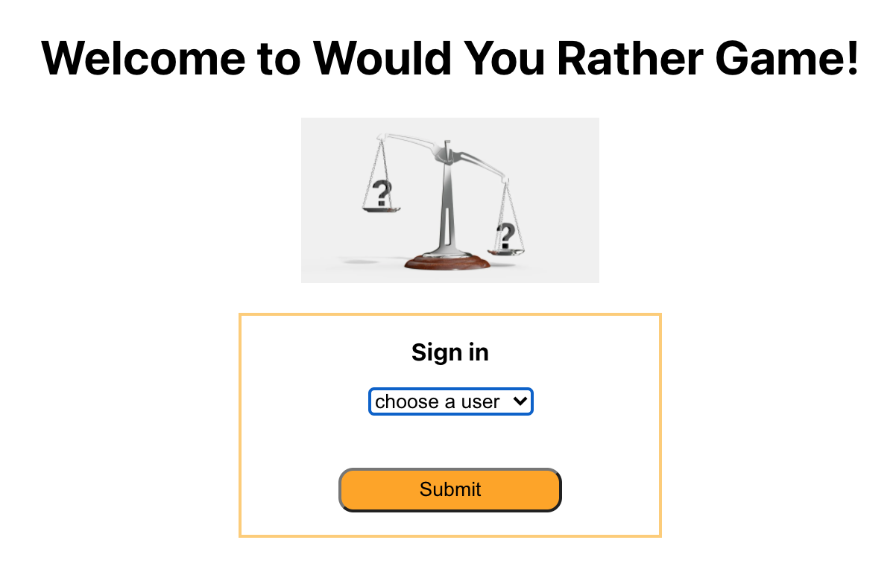
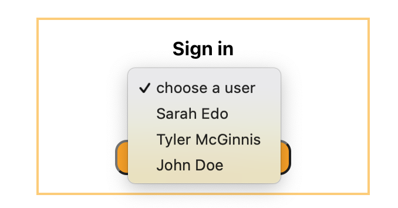
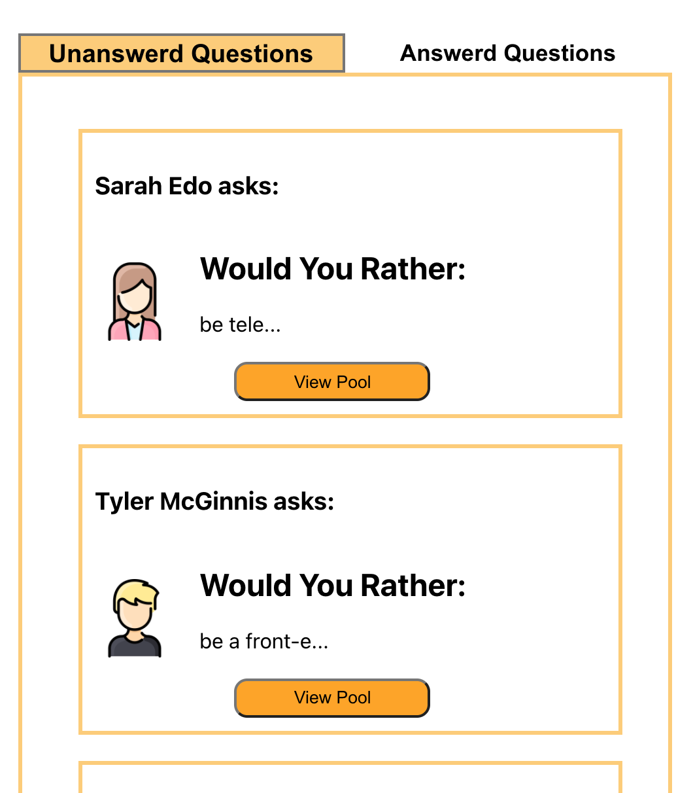
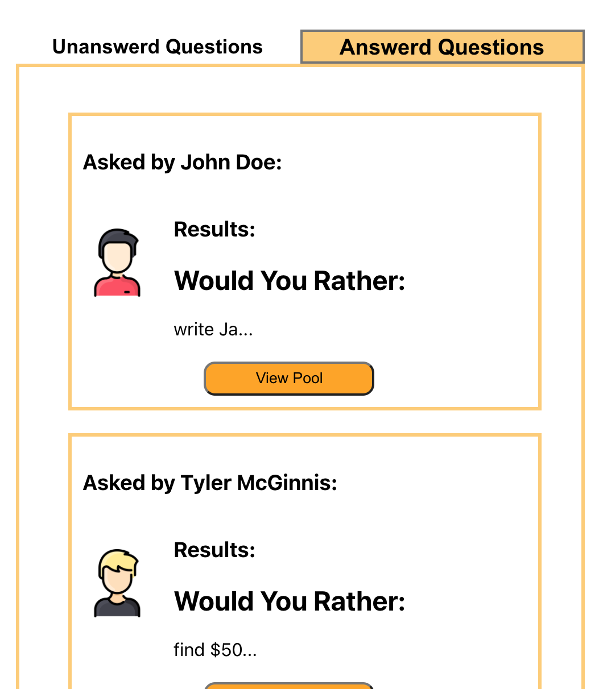
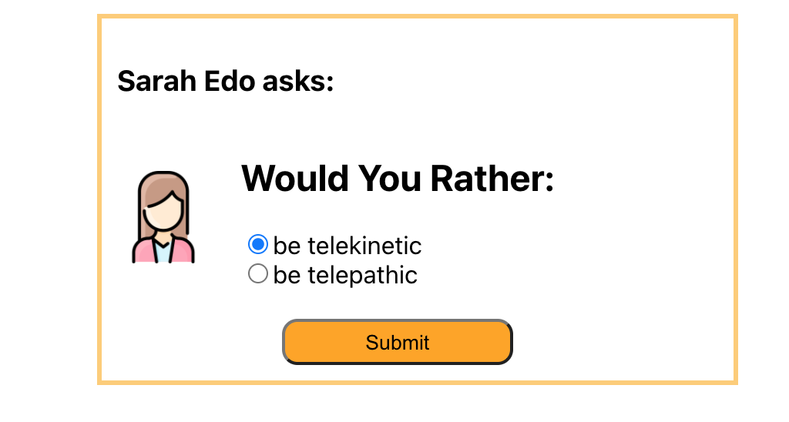
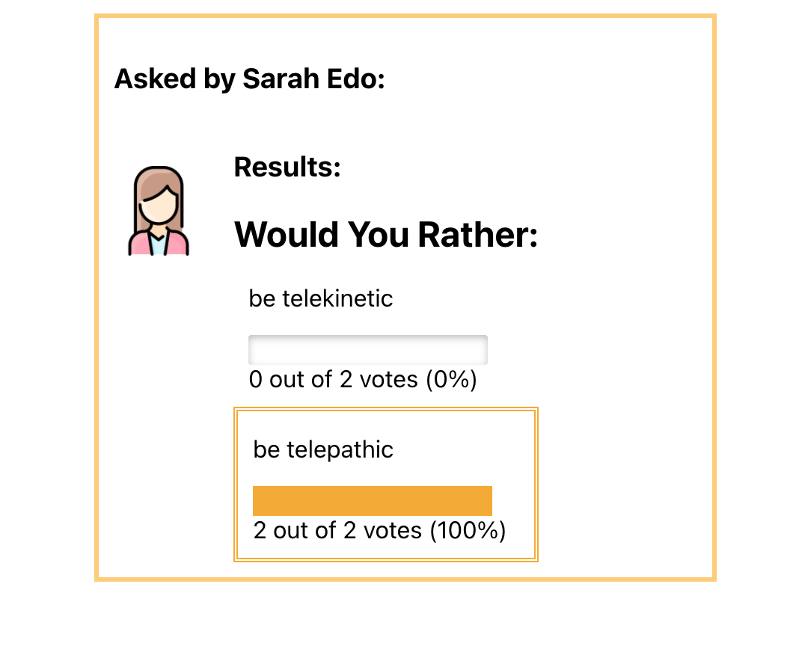
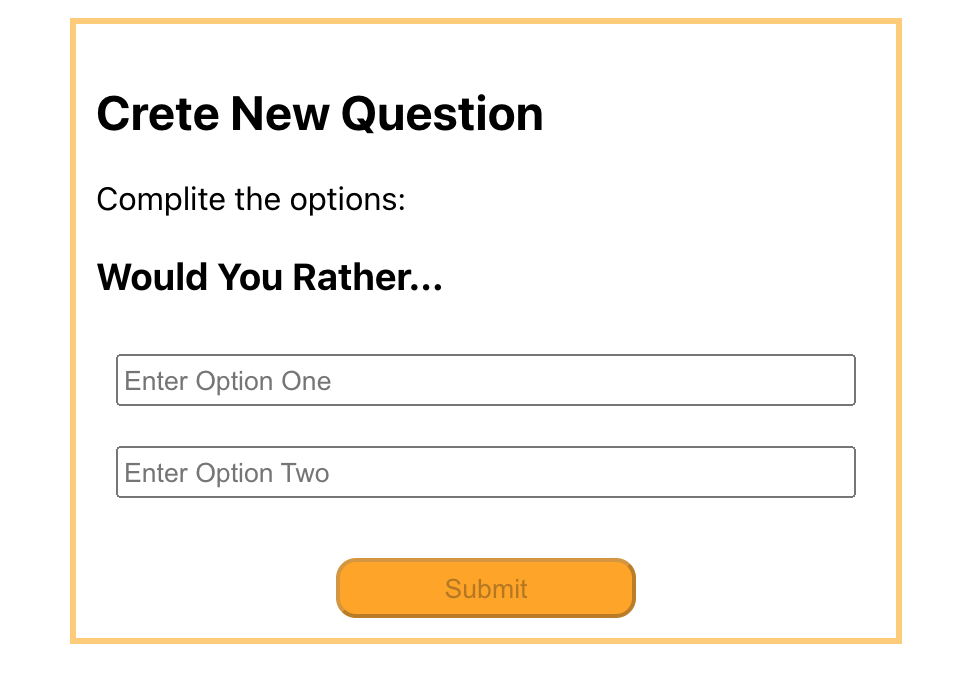
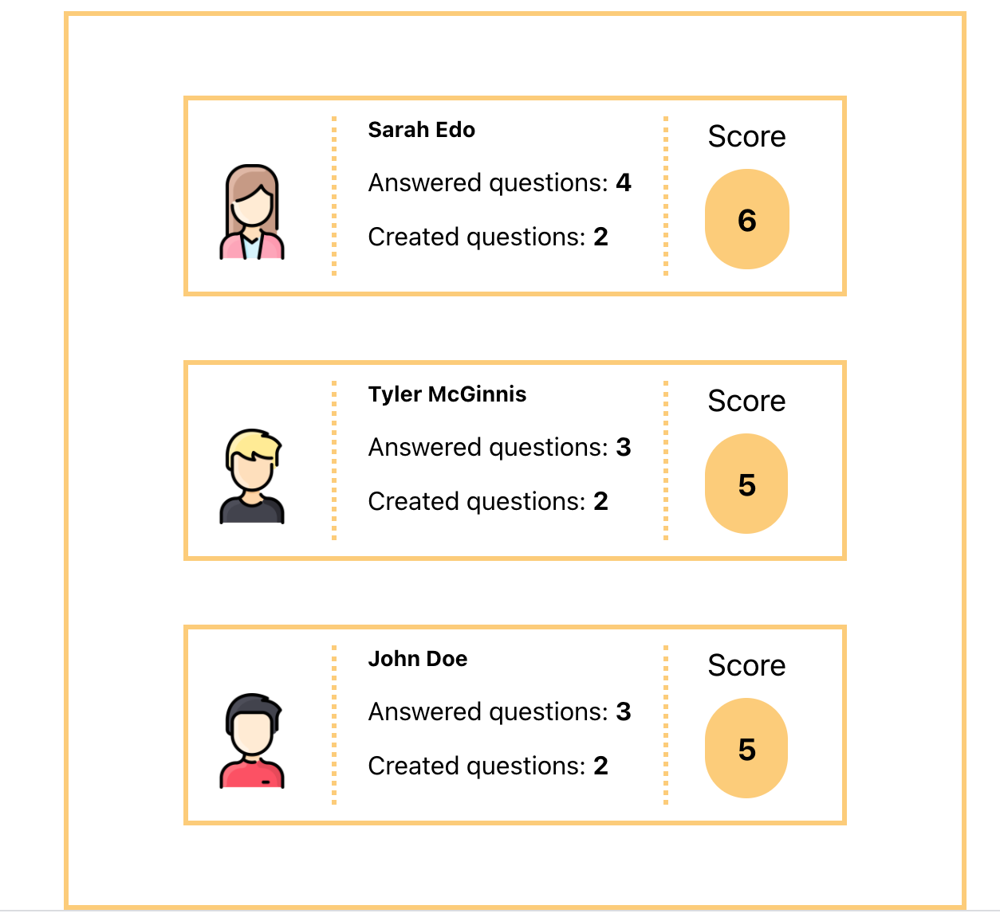
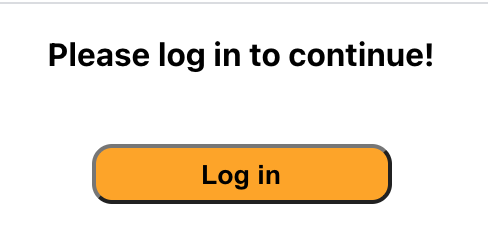
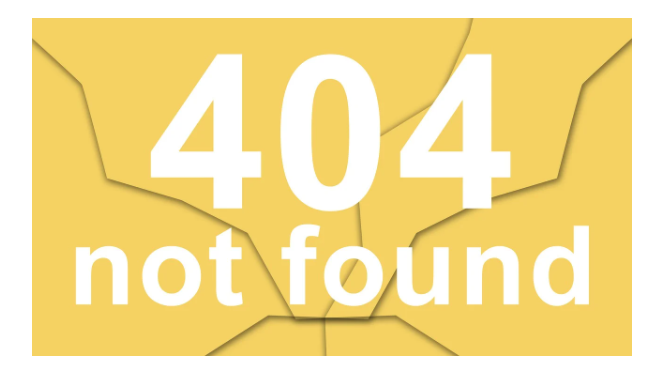

# Would You Rather Project

"Would You Rather" is a web application game. At this game you should give answers to "Would You Rather" questions and you need to choose from only two options. Answering "neither" or "both" is against the rules.

In this app, users are able to answer questions, see which questions they haven’t answered, see how other people have voted, post questions, and see the ranking of users on the leaderboard.

The application:

1. First of all user have to sign in:

  

by choosing a user from available list of users:

2. After logging in the user is redirected to home page(dashboard). Where the user will see a list of questions. The questions are splitted to answered and unanswered questions. User can switch between them by using buttons on this page. By default it opens a list of unanswered questions:

answered questions:

3. The user can view the question by clicking the "View Poll" button.
   Unanswered question looks as:

There the user can vote and after that they will be redirected to the answered question's form. The same form will be opened if the user clicks the "View Poll" button on a page with answered questions. This page shows statistics on how other users voted. The answer that was chosen by the user is marked:

4. The user can add their own question:

   

   After user clicks button “Submit” question will be added to Database, user will be redirected to Home page and new question will be appeared in unanswered question's list.

5. The user is able to navigate to the Leader board and check who is more active user:

6. The user is able to navigate to the leaderboard, to a specific question, and to the form that allows the user to create a new question both from within the app and by typing in the address into the address bar.
   There is a navigation bar that is on all pages exept the Login page.

7. If the user try to open any page by typing in the address into the address bar, they will receive a massage:

8. If the user try to receive a page that isn't exist,
   after the user lologged in there will appear Error 404:

9. The user can log out and log in again.

## **Getting Started**

- install all project dependencies with npm install

- start the development server with npm start

## **Introduction**

The main goal of this project is to learn in practice how Redux React is working and front end for the application.

The `_DATA.js` file represents a fake database and methods that let you access the data.

## Data

There are two types of objects stored in our database:

- Users
- Questions

### Users

Users include:

| Attribute | Type   | Description                                                                                                                                                                                                    |
| --------- | ------ | -------------------------------------------------------------------------------------------------------------------------------------------------------------------------------------------------------------- |
| id        | String | The user’s unique identifier                                                                                                                                                                                   |
| name      | String | The user’s first name and last name                                                                                                                                                                            |
| avatarURL | String | The path to the image file                                                                                                                                                                                     |
| questions | Array  | A list of ids of the polling questions this user created                                                                                                                                                       |
| answers   | Object | The object's keys are the ids of each question this user answered. The value of each key is the answer the user selected. It can be either `'optionOne'` or `'optionTwo'` since each question has two options. |

### Questions

Questions include:

| Attribute | Type   | Description                            |
| --------- | ------ | -------------------------------------- |
| id        | String | The question’s unique identifier       |
| author    | String | The author’s unique identifier         |
| timestamp | String | The time when the question was created |
| optionOne | Object | The first voting option                |
| optionTwo | Object | The second voting option               |

### Voting Options

Voting options are attached to questions. They include:

| Attribute | Type   | Description                                                        |
| --------- | ------ | ------------------------------------------------------------------ |
| votes     | Array  | A list that contains the id of each user who voted for that option |
| text      | String | The text of the option                                             |

Your code will talk to the database via 4 methods:

- `_getUsers()`
- `_getQuestions()`
- `_saveQuestion(question)`
- `_saveQuestionAnswer(object)`

1. `_getUsers()` Method

_Description_: Get all of the existing users from the database.  
_Return Value_: Object where the key is the user’s id and the value is the user object.

2. `_getQuestions()` Method

_Description_: Get all of the existing questions from the database.  
_Return Value_: Object where the key is the question’s id and the value is the question object.

3. `_saveQuestion(question)` Method

_Description_: Save the polling question in the database.  
_Parameters_: Object that includes the following properties: `author`, `optionOneText`, and `optionTwoText`. More details about these properties:

| Attribute     | Type   | Description                                |
| ------------- | ------ | ------------------------------------------ |
| author        | String | The id of the user who posted the question |
| optionOneText | String | The text of the first option               |
| optionTwoText | String | The text of the second option              |

_Return Value_: An object that has the following properties: `id`, `author`, `optionOne`, `optionTwo`, `timestamp`. More details about these properties:

| Attribute | Type   | Description                                                                                                                  |
| --------- | ------ | ---------------------------------------------------------------------------------------------------------------------------- |
| id        | String | The id of the question that was posted                                                                                       |
| author    | String | The id of the user who posted the question                                                                                   |
| optionOne | Object | The object has a text property and a votes property, which stores an array of the ids of the users who voted for that option |
| optionTwo | Object | The object has a text property and a votes property, which stores an array of the ids of the users who voted for that option |
| timestamp | String | The time when the question was created                                                                                       |

4. `_saveQuestionAnswer(object)` Method

_Description_: Save the answer to a particular polling question in the database.
_Parameters_: Object that contains the following properties: `authedUser`, `qid`, and `answer`. More details about these properties:

| Attribute  | Type   | Description                                                                             |
| ---------- | ------ | --------------------------------------------------------------------------------------- |
| authedUser | String | The id of the user who answered the question                                            |
| qid        | String | The id of the question that was answered                                                |
| answer     | String | The option the user selected. The value should be either `"optionOne"` or `"optionTwo"` |

## Authors

Kotova Evgeniia, Udacity(provided data base)
